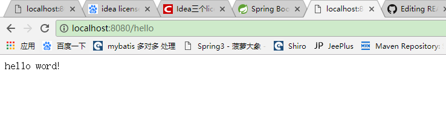

# Spring Boot (一)   Hello Word

## 1、spring boot 简介：

> Spring boot 是一个简化JavaEE的开发方案
>
> spring boot 整合了spring的相关框架，使之更加简单
>
> spring boot 无需大量的XML配置，使代码更加简洁
>
> spring boot 内置了tomcat服务器，使之不需要开发人员繁琐的配置


## 2、环境配置

|     环境      |      版本       |
| :---------: | :-----------: |
|    Maven    |     3.x以上     |
|     Jdk     |     1.7以上     |
| Spring boot | 1.5.9.RELEASE |


## 3、Maven配置

> 在maven的setting.xml 配置文件中的 profiles 标签添加如下：
>
> 当然你或许用的是1.7 , 那么你把1.8改成1.7即可

```xml
<!-- 此标签用于告知maven编译代码是选用JDK 1.8 -->
<profile>
  <id>jdk-1.8</id>
  <activation>
    <activeByDefault>true</activeByDefault>
    <jdk>1.8</jdk>
  </activation>
  <properties>
    <maven.compiler.source>1.8</maven.compiler.source>
    <maven.compiler.target>1.8</maven.compiler.target>
    <maven.compiler.compilerVersion>1.8</maven.compiler.compilerVersion>
  </properties>
</profile>
```


## 4、在eclipse或者IDEA中建立Maven项目，并导入依赖

建立maven项目我们可以选择打包方式为jar，后面我们通过java -jar就可以部署了！

```xml
 <!-- 使用spring-boot-starter-parent 来快速构建项目，其中所配置的依赖会传递过来 -->
 <parent>
    <groupId>org.springframework.boot</groupId>
    <artifactId>spring-boot-starter-parent</artifactId>
    <version>2.0.0.RELEASE</version>
 </parent>
<!-- 配置 spring-boot-starter-web 启动器 -->
 <dependencies>
   <dependency>
     <groupId>org.springframework.boot</groupId>
     <artifactId>spring-boot-starter-web</artifactId>
   </dependency>
 </dependencies>
```


## 5、编写Cotroller 和 测试类

```java
package indi.qiaolin.boot.helloword;

import org.springframework.boot.SpringApplication;
import org.springframework.boot.autoconfigure.SpringBootApplication;
import org.springframework.stereotype.Controller;
import org.springframework.web.bind.annotation.RequestMapping;
import org.springframework.web.bind.annotation.ResponseBody;

/**
 *  spring boot Hello word 测试Controller
 *  @author  qiaolin
 *  @date 2018年3月23日
 */

@Controller
public class TestController {

    @RequestMapping("hello")
    @ResponseBody
    public String hello(){
        return "hello word!";
    }
  
}
```

测试类如下：

```java
package indi.qiaolin.boot.helloword;

import org.springframework.boot.SpringApplication;
import org.springframework.boot.autoconfigure.SpringBootApplication;

/**
 *  @author  qiaolin
 *  @date 2018年3月23日
 */

@SpringBootApplication // 标注这是一个SpringBoot应用
public class MainApplication {
    public static void main(String[] args) {
        SpringApplication.run(MainApplication.class, args);
    }
}
```

然后在测试类中或者选中测试类右击 run 

```java

  .   ____          _            __ _ _
 /\\ / ___'_ __ _ _(_)_ __  __ _ \ \ \ \
( ( )\___ | '_ | '_| | '_ \/ _` | \ \ \ \
 \\/  ___)| |_)| | | | | || (_| |  ) ) ) )
  '  |____| .__|_| |_|_| |_\__, | / / / /
 =========|_|==============|___/=/_/_/_/
 :: Spring Boot ::        (v2.0.0.RELEASE)

省略日志....
TomcatWebServer  : Tomcat started on port(s): 8080 (http) with context path ''
MainApplication:Started MainApplication in 2.973 seconds(JVM running for 4.801)
Initializing Spring FrameworkServlet 'dispatcherServlet'
FrameworkServlet 'dispatcherServlet': initialization started
FrameworkServlet 'dispatcherServlet': initialization completed in 24 ms

```

我们可以看到 Tomcat started on port(s): 8080 (http)  tomcat已经启动

我们只需要打开浏览器输入：ip:端口/接口名  例如我上面的hello 接口 ： localhost:8080/hello

无需写项目名

